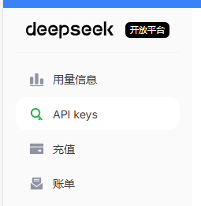
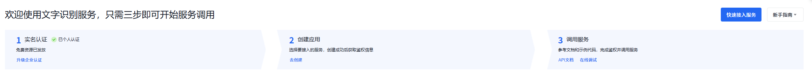

# DeepSeek 自动答题系统

基于 DeepSeek AI 和百度 OCR 的智能自动答题系统，支持单选、多选、判断题。

## 注意事项

- 标记选项位置时，按 ESC 可跳过不需要的选项
- 最后一题会点击答案但不会点击提交按钮，但是不会识别一共多少题，题目数量需手动输入 （！！！请输入准确或少输入一两题，否则可能会被自动提交） 
- 无法识别图像部分

## 功能特点

- ✅ 支持单选题、多选题、判断题
- ✅ 使用百度 OCR 识别题目文字
- ✅ 使用 DeepSeek AI 分析答案
- ✅ 支持深度思考模式（deepseek-reasoner）
- ✅ 手动标记选项位置，精确点击
- ✅ 自动答题
- ✅ 实时日志显示

## 配置 API Key

运行程序后，在界面上配置：

1. **DeepSeek API Key**
   - 获取地址：https://platform.deepseek.com/
   - 用于 AI 分析题目

方法：在该网址注册，实名后，充值1-2元购买模型，接着创建API（DeepSeek的API只有在创建的最开始才能被复制，请妥善保存），获得key后保存。

2. **百度 OCR API Key 和 Secret Key**
   - 获取地址：https://console.bce.baidu.com/ai/#/ai/ocr/overview/index
   - 用于识别题目文字
   - 免费版足够正常个人使用（每月几千次）

方法：在该网站注册，实名后，点击2.创建应用中的去创建，完成后在左侧选择应用列表，保存API Key，Secret Key。

3. **运行程序，填写好相对应的三个key**

### 依赖库

- openai - DeepSeek AI API
- pyautogui - 自动化控制
- pillow - 图像处理
- requests - HTTP 请求

## 许可证

MIT License

## 免责声明

本项目仅供学习交流使用，请勿用于违反相关规定的场景。使用本项目产生的任何后果由使用者自行承担。

